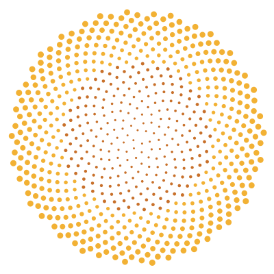

# Hi, I'm Sidharth

CS undergrad from Ahmedabad (graduating 2027). I like building things end to end, solving puzzles and making math move.

That sunflower up there is 700 dots, each one turned 137.5° from the last. Change that one number even slightly and the whole pattern falls apart. I spent summer 2026 at IIT Gandhinagar's Centre for Creative Learning turning ideas like this into animations for their Eklavya programme. One of them is at 19,000+ views now. ([14 lines of Python](sunflower.py) if you want to play with it.)

## Things I've built lately
- [face3d](https://github.com/CjSidharth/face3d) - one photo of a face in, a 3D-printable bust out. Runs on my MacBook, no CUDA needed.
- [smart-glasses](https://github.com/CjSidharth/smart-glasses) - a webcam that says *"Chair ahead"* out loud. Made for visually impaired people, works fully offline.
- [assignment-dictator](https://github.com/CjSidharth/assignment-dictator) - turns photos of handwritten notes into dictation audio so I can copy them by hand. Fully local, fully free.
- [ambi-trainer](https://github.com/CjSidharth/ambi-trainer) - train your other hand to write. Or both at once.
- [GroundTruth](https://github.com/CjSidharth/groundtruth) - my exam prep app. You attempt the answer first, then the AI checks it against your own notes, with page numbers. It holds 6,748 questions across 19 subjects and got me through a whole exam cycle.
- [FlipNote](https://flipnote.in) - PDFs in, flashcards, mind maps and explainer videos out. Built with 4 friends; I did the 3D simulations, Manim videos and Docker deploy.
- **Sentinel** - CCTV analytics for the Gujarat Police hackathon with two friends. Reads number plates and finds a person across recordings from one photo. [Demo video](https://youtu.be/RsuzQ23YuZs). *(team repo, private)*

## Other stuff
- 137 AtCoder contests and counting, all in [problem-practice](https://github.com/CjSidharth/problem-practice).
- KenKen India national gold medalist, 2018 & 2021. Yes, the puzzle.
- Older things I still like: [game-of-life](https://github.com/CjSidharth/game-of-life), an unbeatable [tic-tac-toe](https://github.com/CjSidharth/tic-tac-toe) (minimax) and [dodge-the-fish](https://github.com/CjSidharth/dodge-the-fish), my first game from 2021.

## Currently
- [x] Summer internship at IIT Gandhinagar
- [ ] Building transformers from scratch (ARENA)
- [ ] Learning what's really under the hood of everything I use

Say hi on [LinkedIn](https://linkedin.com/in/cjsidharth).
